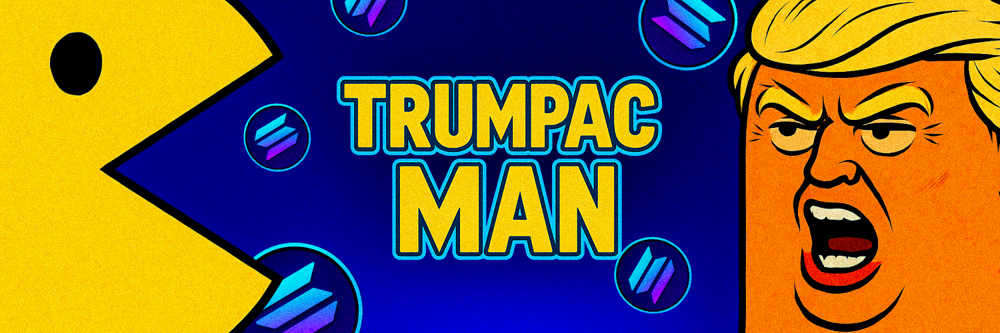

# Trump-Man

A retro-futuristic Pac-Man game with a modern design, custom sprites, and Solana blockchain integration.

## How to Play

1. Open `index.html` in your web browser
2. Use arrow keys to move Trumpac-Man
3. Eat all pellets to advance to the next level
4. Avoid ghosts, except after eating a power pellet
5. Press 'P' to pause the game

## Features

- Retro-futuristic design with neon effects
- Ghost AI faithful to the original game
- Score and lives system
- Responsive interface
- Multiple levels with progressive difficulty
- Solana cryptocurrency integration

## Technology

Developed with HTML5, CSS3, and vanilla JavaScript. The game features Solana blockchain integration, allowing players to collect Solana tokens throughout gameplay. This project demonstrates how traditional gaming experiences can be enhanced with modern blockchain technology, creating an engaging and potentially rewarding gaming experience.

## Solana Integration

Trumpac-Man leverages the Solana blockchain's fast transaction speeds and low fees to create a seamless gaming experience. Players can:
- Collect Solana tokens as they play
- View their wallet address directly in the game interface
- Experience the fusion of classic arcade gaming with modern crypto technology